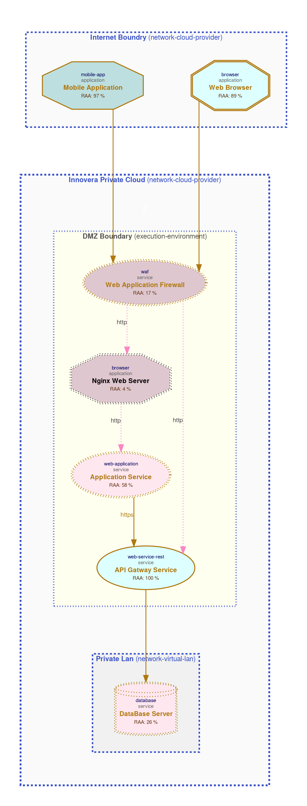

# threagile-sample


```
Threagile is the open-source toolkit which allows to model an architecture with its assets in an agile
declarative fashion as a YAML file directly inside the IDE or any YAML editor. Upon execution of the Threagile 
toolkit a set of risk-rules execute security checks against the architecture model and create a report with
potential risks and mitigation advice. Also nice-looking data-flow diagrams are automatically created as well 
as other output formats (Excel and JSON). The risk tracking can also happen inside the Threagile YAML model file, 
so that the current state of risk mitigation is reported as well. Threagile can either be run via the command-line
(also a Docker container is available) or started as a REST-Server.
```

Here we have a sample threat modeled by using a  [**threagile**](https://threagile.io/) toolkit.


# System Overview

In this simple example we have a payment service. Users can connect to the 
payment service through the browser and mobile application and use its services.


The following is the system architecture:


# Output
Data-Asset Diagram

Data-Flow Diagram



